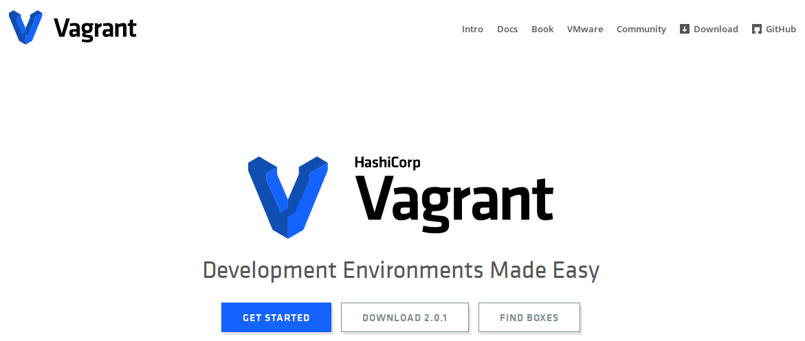

# INSTALLATION OF COURSE SOFTWARE

## OVERVIEW

In this course, we will seek to use a common analysis stack to facilitate deployment of the 
necessary tools and increase the probability that technical questions that do arise have wide
application across students.  With this in mind, we are using the following tools: 

1. [VirtualBox](https://www.virtualbox.org) is a virtualization product that will allow us all to 
use the same operating system, no matter what operating system (e.g. Windows, OSX, Linux, etc.)
you use.  (Well, if you wrote your own operating system, you may be out of luck.)

2. [Ubuntu](https://www.ubuntu.com) is an open-source operating system, specifically of the Linux
variety. The advantages of Ubuntu (and 
[Linux distributions](https://en.wikipedia.org/wiki/Linux_distribution) in general) are many.  For
our purposes, however, it is helpful that they are unix-based, which is the development environment
used for many of the tools we will employ. The upshot is that installations can go more smoothly in
many cases. (Note that OSX is similar under the hood, and can often leverage similar benefits.)
Secondly, and this is important, linux distributions *tend to be free*. Ubuntu, specifically, is a
user-friendly environment that retains similar functionality to Windows and Mac environments, while
also providing access to the robust suite of linux utilities.

3. [Vagrant](https://www.vagrantup.com) is a tool that eases the set up of development environments.
For our purposes, it will work in concert with VirtualBox to help students easily install all of the
analytic software and utilities we will use in this course. Students will need to install VirtualBox
and Vagrant, in addition to acquiring the Ubuntu OS image (that is, a file that holds the Ubuntu
OS). Upon doing so, the `Vagrantfile` we provide will execute steps that 1) set up the virtual
environment, 2) install Ubuntu, and 3) install all of the analytic software we will use this
semester.

These tools will be new to most of you, but they help us [construct a reporducible analytic
environment](https://medium.com/@JohnFoderaro/how-to-set-up-a-local-linux-environment-with-vagrant-163f0ba4da77).
One of the key objectives of this course is to introduce you to tools and workflow that allow you to
both recreate analysis and transparently share what you have done with others.  In so doing, we
reduce ambiguity around the choices we have made and, thereby, either bolster our conclusions or
efficiently identify opportunities for improvement.

## ACQUISITION OF INSTALLATION MEDIA

Installation of VirtualBox and Vagrant in Windows and OSX environments can generally be handled by
installation wizards.  To acquire the appropriate files, students can click on the respective sites
below and find the installers in the "Downloads" section for each application site. If installation
is occurring in a linux environment, installation instructions will differ based upon the flavor of
linux used. 

## INSTALLATION OF VIRTUALBOX AND VAGRANT

The videos below provide representative walkthroughs of installation on both Windows and Mac
machines.  

### Windows

The first video focuses on installation of VirtualBox and Vagrant on Windows, but the author
actually gives a pretty solid overview of how these tools work together.  

### OSX

## ADDITIONAL RESOURCES

*Note that, in general, there are numerous videos on [YouTube](https://www.youtube.com) that provide
great information about all of the tools we will be using, from applications to operating systems.
Students are strongly encouraged to use it as an informational source.*

### The Unix Shell

One of the biggest advantages of operating in a unix-based or adjacent environment is the
[shell](https://en.wikipedia.org/wiki/Unix_shell).
While it is true that Windows offers command line access, unix-based systems have generally featured
the shell as the cornerstone of interaction with the computer. This method of interacton can be far
more flexible and efficient than interaction via the [Graphical User
Interface](https://en.wikipedia.org/wiki/Graphical_user_interface) (GUI) after learning just a few
of the basic functions available. That said, I won't sugar coat it, it takes practice.  Fortunately,
[Software Carpentry](https://software-carpentry.org) has, among a host of great resources, a solid
[introduction](https://swcarpentry.github.io/shell-novice/) to the [Bourne Again
Shell](https://en.wikipedia.org/wiki/Bash_(Unix_shell)) (bash). bash is fairly ubiquitous in the
Unix space, and the syntax it employs also works in large part in OSX. Learning how to use it will
probably make your life easier. For folks that prefer a video walkthrough of features, here is a
representative video that can be found on YouTube:

