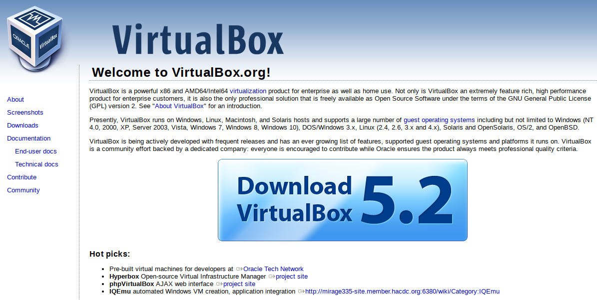

# INSTALLATION OF COURSE SOFTWARE

## OVERVIEW

In this course, we will seek to use a common analysis stack to facilitate deployment of the 
necessary tools and increase the probability that technical questions that do arise have wide
application across students.  With this in mind, we are using the following tools: 

1. [VirtualBox](https://www.virtualbox.org) is a virtualization product that will allow us all to 
use the same operating system, no matter what operating system (e.g. Windows, OSX, Linux, etc.)
you use.  (Well, if you wrote your own operating system, you may be out of luck.)

2. [Ubuntu](https://www.ubuntu.com) is an open-source operating system, specifically of the Linux
variety. The advantages of Ubuntu (and 
[Linux distributions](https://en.wikipedia.org/wiki/Linux_distribution) in general) are many.  For
our purposes, however, it is helpful that they are unix-based, which is the development environment
used for many of the tools we will employ. The upshot is that installations can go more smoothly in
many cases. (Note that OSX is similar under the hood, and can often leverage similar benefits.)
Secondly, and this is important, linux distributions *tend to be free*. Ubuntu, specifically, is a
user-friendly environment that retains similar functionality to Windows and Mac environments, while
also providing access to the robust suite of Linux utilities.

These tools will be new to most of you, but they help us [construct a reproducible analytic
environment](https://medium.com/@JohnFoderaro/how-to-set-up-a-local-linux-environment-with-vagrant-163f0ba4da77).
One of the key objectives of this course is to introduce you to tools and workflow that allow you to
both recreate analysis and transparently share what you have done with others.  In so doing, we
reduce ambiguity around the choices we have made and, thereby, either bolster our conclusions or
efficiently identify opportunities for improvement.

## ACQUISITION OF INSTALLATION MEDIA

Installation of VirtualBox in Windows and OSX environments can generally be handled by
installation wizards.  To acquire the appropriate files, students can click on the site
below and find the installers in the "Downloads" section for each application site. If installation
is occurring in a linux environment, installation instructions will differ based upon the flavor of
linux used. 

With respect to Ubuntu, you don't need to install it just yet (that will occur on the Virtual
Machine itself. You do, however, need a copy of the ISO file that holds the operating system. You
can download it (v17.10) from the [Ubuntu Downloads page](https://www.ubuntu.com/download/desktop).
Save it somewhere that is easily accessible.

## INSTALLATION OF VIRTUALBOX 

The videos below provide representative walkthroughs of installation on both Windows and Mac
machines.  

### Windows

### OSX

## VIRTUAL MACHINE SET UP

Once you have VirtualBox installed and the Ubuntu ISO saved to disk, launch VirtualBox and create a
new VM by clicking on the "NEW" button. Name it whatever you like, but the type should be "Linux"
and the version should be "Ubuntu (64-bit)". You can walk through the install with the defaults for
the most part, but keep in mind that the amount of memory you allocate will affect the performance
of the VM.  

When you finish the installer, do not panic if you try to boot the machine and it fails. You will
need to navigate to "Devices > Optical Drives > Choose Disk Image...", and then select the Ubuntu
ISO file you saved earlier. This will allow you to install Ubuntu on the VM.

Once you have installed Ubuntu (and after a restart), open your greatest and best friend, the [bash
shell](https://en.wikipedia.org/wiki/Bash_(Unix_shell)). It's the icon in the left panel that
looks kind of like a less stylish version of the image below, and it can be started by double-clicking 
on it.

After all that work to get a GUI, we are back at the command line. Execute all of the commands in
[provision.sh] and you should have the tools we will use in the course.

## ADDITIONAL RESOURCES

*Note that, in general, there are numerous videos on [YouTube](https://www.youtube.com) that provide
great information about all of the tools we will be using, from applications to operating systems.
Students are strongly encouraged to use it as an informational source.*

### The Unix Shell

One of the biggest advantages of operating in a unix-based or adjacent environment is the
[shell](https://en.wikipedia.org/wiki/Unix_shell).
While it is true that Windows offers command line access, unix-based systems have generally featured
the shell as the cornerstone of interaction with the computer. This method of interacton can be far
more flexible and efficient than interaction via the [Graphical User
Interface](https://en.wikipedia.org/wiki/Graphical_user_interface) (GUI) after learning just a few
of the basic functions available. That said, I won't sugar coat it, it takes practice.  Fortunately,
[Software Carpentry](https://software-carpentry.org) has, among a host of great resources, a solid
[introduction](https://swcarpentry.github.io/shell-novice/) to the [Bourne Again
Shell](https://en.wikipedia.org/wiki/Bash_(Unix_shell)) (bash). bash is fairly ubiquitous in the
Unix space, and the syntax it employs also works in large part in OSX. Learning how to use it will
probably make your life easier. For folks that prefer a video walkthrough of features, here is a
representative video that can be found on YouTube:

